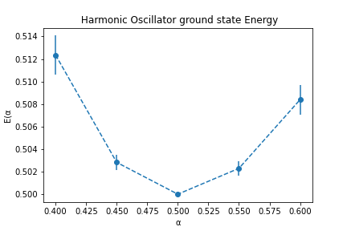
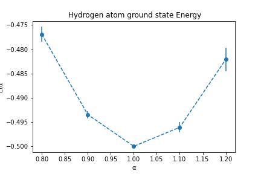
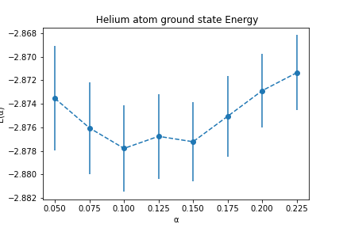
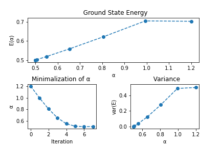
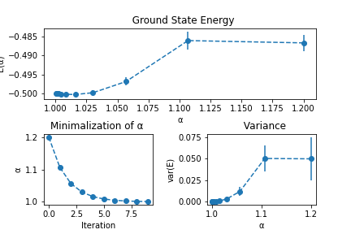
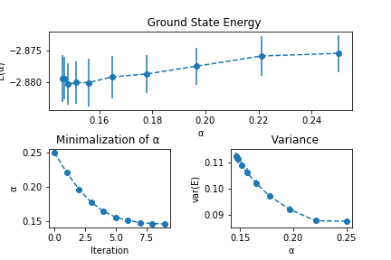

*  # Weekly progress journal

## Instructions

In this journal you will document your progress of the project, making use of weekly milestones. In contrast to project 1, you will need to define yourself detailed milestones.

Every week you should 

1. define **on Wednesday** detailed milestones for the week (according to the
   high-level milestones listed in the review issue).
   Then make a short plan of how you want to 
   reach these milestones. Think about how to distribute work in the group, 
   what pieces of code functionality need to be implemented. 
2. write about your progress **before** the Tuesday in the next week with
   respect to the milestones. Substantiate your progress with links to code,
   pictures or test results. Reflect on the relation to your original plan.

Note that there is a break before the deadline of the first week review
issue. Hence the definition of milestones and the plan for week 1 should be
done on or before 15 April.

We will give feedback on your progress on Tuesday before the following lecture. Consult the 
[grading scheme](https://computationalphysics.quantumtinkerer.tudelft.nl/proj2-grading/) 
for details how the journal enters your grade.

Note that the file format of the journal is *markdown*. This is a flexible and easy method of 
converting text to HTML. 
Documentation of the syntax of markdown can be found 
[here](https://docs.gitlab.com/ee/user/markdown.html#gfm-extends-standard-markdown). 
You will find how to include [links](https://docs.gitlab.com/ee/user/markdown.html#links) and 
[images](https://docs.gitlab.com/ee/user/markdown.html#images) particularly
useful.

## Week 1
- At first the harmonic oscillator wull be considered since the trial wavefunction for such system is known in the literature. By Achmed 

- The trial wave function will be $\exp{-{\alpha}x^{2}}$. For the harmonic oscillator there is already a data of numerical data to compare with in the book of Dr.J.Thijssen. By Kadhim 

- The trial wavefunction will be used in the local energy to get a valid expression. By Achmed

- The Monte carlo method is then used to calculate the integral by summing over the samples obtained by the Metropolis smapling mehtod. By Kadhim

- The overall acceptance rate will be observed by counting the accepted moved and dividing that to the total moves done. by Achmed

- The expected energy will be calculated using `np.mean()` and it will be done for different alphas corresponding to the alphas also used by jos thijsen to compare the results with.

## Progress

- we tuned the metropolis algorithm so that it had a reasonable total acceptance rate of 0.647. This was done by varying the initial move of the walkers inside a box,
The code to this is :`displacement = 0.8*np.random.randn(N_tries, N_walkers, D)` which is located in the `Metropolis.py` file.

- For checking the condition that for a given move it is acceptable or not the function `np.where()` was used. This helped speed up the code compared to a for loop.

- We calculated the expectation energy with `maincode.py` for diffrent alphas the results are: E(alpha) = [0.5124047  0.50288855 0.5        0.50231386 0.50834459], for alpha = [0.4  0.45 0.5  0.55 0.6 ]
With variance of : sigma = [0.0252834  0.00560066 0.         0.00454688 0.01681602]
- These results obtained are in very good accordance to the values obtained by Jos Thijsen for the harmonic Oscillator

## Week 2
(due before 28 April)

- We have to add more examples to calculalte. For example, Hydrogen atom and also implement the helium atom.
- Have to tune the acceptance rate for each of them.
- We will add docstrings to the code.
- Have to add error calculation for the energy and variance of energy.

## Progress:
- added the hydrogen and helium atom, since this are now in 3D we had to take this into account while calculating the trail wave function and local energy. Since we only use the variable 'r'.
So we had to use the magnitude of the r vector with the code: `r = np.linalg.norm(r, axis = 1, keepdims = True)` since r is in dimension (N_walkers,Dimension).

- For the helium atom there are 2 electrons each in 3 dimension. To still have only 1 r as an variable, we make the r matrix into a (N_walkers, 6). So we make it 6 dimensional,
and we use the first 3 rows for the 1st electron and the final 3 the 2nd electron with the code: `r1 = np.linalg.norm(r[:,:3], axis = 1, keepdims = True)`, `r2 = np.linalg.norm(r[:,3:], axis = 1, keepdims = True)`.

- The Energies were calculated for different alphas and the results is visible in the `maincode.ipynb` 
Comparing the values the the values of Jos Thijsen, we see that there is a very good correpondes. Only the overall acceptance rate for the hydrogen atom is a bit too high, and the one for the helium atom is too little.
This has to be adjusted by varying `displacement = 0.8*np.random.randn(N_tries, N_walkers, D)` code in the `Metropolis.py` file.
- The results from `maincode.ipynb` ground state energy for harmonic oscillator, hydrogen atom and Helium atom with error bars included.
- 

- It seems that both the harmonic oscillator and hydrogen atom are in agreement with the literature of jos thijsen and also with the analytical values. For the 
Harmonic oscillator the analitical value is E = 0.5 which in the graph is also noticable. For Hydrogen atom the analitcal value is E = -0.5 again in correspondence with our simulation.
Also the Helium atom is in accordance with the literature, we would expect a minimum around alpha = 0.15. 

## Week 3
(due before 5 May)

- Explain how our code fulfills the detailed balance
- Add doctrings
- Fix the acceptance rate issue with Helium atom
- Implement steepest descent method to find the optimal Energy
- minimize alpha and the energy and plot the results

## Progress:

- There was an issue with the Helium atom simulation where the acceptance rate would go above 1. We forgot to include the dimension in the calculating of the acceptance rate
We added it to the code: `rate = accept/(N_tries*N_walkers*D)` where the addition od the D is the fix, in the [`Metropolis.py`](https://gitlab.kwant-project.org/computational_physics_projects/Project-2---QMC_N_mido1/-/blob/master/Functions/Metropolis.py) file.

- For the mimimalization we used the steepest descent method, the new alpha was found with the old alpha and the derivative of the energy: α_new = α_old − γ*(dE/dα)_old. Because we use a while loop to search for the optimal value, we cannot initialize numpy arrays to store the values found.
To still store them we had to append the values to a python list and later convert them into numpy arrays with: `Eloc_values = np.array(Eloc_values)` of the minimalAlphaFinder function in the [`Mimimalization.py`](https://gitlab.kwant-project.org/computational_physics_projects/Project-2---QMC_N_mido1/-/blob/master/Functions/Minimalization.py) file.

- We were able to minimize the alpha for the 3 systems and here are the results:

- Harmonic Oscillator: 

- Hydrogen atom: 

- Helium Atom: 

- These results were obtained by running the [`OptimalEnergy.ipynb`](https://gitlab.kwant-project.org/computational_physics_projects/Project-2---QMC_N_mido1/-/blob/master/OptimalEnergy.ipynb) file. The output with the optimal enrgies is also given there.
The results for the harmonic oscillator and the Hydrogen atom look as expected with the Energy approaching 0.5 and -0.5 respectively, with that their variance also go to zero as the aproach these values.
With the helium atom however the variance increases for smaller values of alpha, and because it has quite a large error in the energy. This might be because our trail wave function is not optimal.
